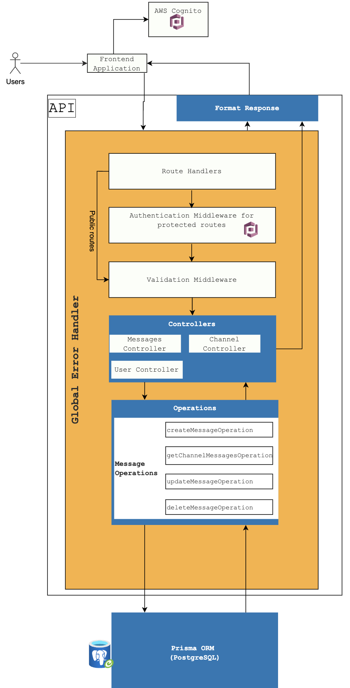

## Introduction

Welcome to this blog post on building a secure Express application with TypeScript, AWS Cognito and Prisma ORM. In this project, I had the opportunity to upskill myself in various areas including Node.js, TypeScript, clean code principles, best practices, AWS Cognito, validation using Joi, ORM concepts, and more.

Throughout the project, I worked closely with my mentor, [Robert Wilkinson](https://robertwilkinson.dev/), who provided invaluable guidance and support. With his help, I was able to develop a robust and secure application architecture that I'm excited to share with you.

I'll cover each component in detail, providing step-by-step instructions, code examples, and explanations of the core concepts. By the end of this post, you'll have a comprehensive understanding of each technology and how it fits into the overall architecture.

Let's dive into the application architecture!

## Section 1: Overview of the architecture

This architecture ensures a robust and scalable foundation for our application.



### 1. AWS Cognito Authentication Middleware

At the core of our application's security is AWS Cognito, a powerful authentication and user management service provided by Amazon Web Services (AWS). We utilize AWS Cognito Authentication Middleware to handle user authentication. This middleware ensures that only authenticated users can access protected routes in our application.

### 2. Route Handlers

Route Handlers are responsible for handling incoming requests and directing them to the appropriate controllers. They act as the entry point for requests and are responsible for request routing and initial request processing.

### 3. Validation Middleware

Validation Middleware plays a role in validating requests and ensuring proper data handling. We have used the popular Joi library as our choice for request validation, but you can choose any validation library that suits your preferences and requirements. The validation process ensures that incoming requests adhere to predefined schemas or rules, verifying that the data is in the correct format and meets the necessary criteria for further processing.

By incorporating the Validation Middleware into our architecture, we can confidently handle requests, knowing that the data has been **validated** and is ready for processing by the appropriate components. This step adds an extra layer of security and reliability to our application.

### 4. Controllers

Controllers are the heart of our application, responsible for processing requests and orchestrating the interactions between various components. They serve as the bridge between incoming requests and the underlying business logic. Each controller in our architecture has a specific purpose and focuses on a **single responsibility**.

Here are some examples of our controllers:

- **Message Controller**: This controller handles operations related to messages within our application. It receives requests and then passes on the responsibility of performing actual database operations to the relevant Message Operations component.

- **Channel Controller**: The Channel Controller manages channels, which serve as containers for messages. Similarly, it passes on database operations to the Channel Operations component.

- **User Controller**: The User Controller is responsible for managing user-related operations. Similarly, it passes on database operations to the User Operations component.

By following the single responsibility principle, controllers are designed to focus on request handling by delegating tasks to dedicated components. This approach ensures a clear separation of concerns, improving code organisation, maintainability, and reusability across our application.

### 5. Operations

Operations encapsulate the business logic of our application. They define reusable functions that handle specific tasks within our controllers. These functions interact with the database using Prisma to perform the necessary operations.

For example, within our message-related operations, we have created the following operations:

#### 5a. Message operations

- **createMessageOperation**: Handles the creation of new messages.
- **getChannelMessagesOperation**: Retrieves messages for a specific channel.
- **updateMessageOperation**: Updates an existing message.
- **deleteMessageOperation**: Deletes a message from the system.

The operations provide a clear separation between the controller and the database, allowing for easier testing, debugging, and future enhancements.

### 6. Prisma ORM (PostgreSQL)

[Prisma ORM](https://www.prisma.io/) is an essential component of our architecture, providing a type-safe database toolkit. It enables us to interact with the PostgreSQL database efficiently. Prisma ORM simplifies database operations, including querying, migrations, and data modelling.

### 7. Global Error Handler (Middleware)

The Global Error Handler is a middleware component that catches errors occurring at any step of the request lifecycle. It provides a centralized mechanism to handle and respond to errors consistently. By implementing this middleware, we can gracefully handle exceptions, log errors, and send appropriate error responses to clients.

## Section 2: Building the Application

### 1. Route Handlers, Controllers, and Operations

Our initial file structure looks like this:

```bash
- src
  - server.ts
  - app.ts
  - routes
    - messagesRoutes.ts
    # other routes
  - controllers
    - messagesController
        - createMessage
            - createMessage.test.ts
            - createMessage.ts
            - index.ts
    # other controllers
        - operations
            - createMessageOperation
              - createMessageOperation.test.ts
              - createMessageOperation.ts
              - createMessageOperation.types.ts
              - index.ts
        # other operations
```

### server.ts

This file contains the code to start the Express server. By separating the server initialization logic, it keeps this file clean and focused only on starting the app. This approach also makes it easier to test the server initialization logic.

```typescript
import { app } from './app';
import dotenv from 'dotenv';

dotenv.config();
const PORT = parseInt(process.env.PORT || '3000');

async function startServer() {
  app.listen(PORT, () => ...);
}

startServer();
```

### app.ts

This file initializes the Express app instance and defines route middlewares. It also defines a catch-all route to handle any requests that do not match the defined routes. By creating a single app instance and managing routes centrally, it follows best practices of separation of concerns.

```typescript
import express, { Request, Response, NextFunction } from 'express';
import messagesRoutes from './routes/messagesRoutes';

const app = express();

app.use('/api/messages', messagesRoutes);
// other routes

app.use('*', (req: Request, res: Response, next: NextFunction) => {
  const error = new Error(`Route ${req.originalUrl} not found!!!`);
  next(error);
});

export { app };
```

As you can see, we are using the `messagesRoutes` middleware to handle all requests to the `/api/messages` endpoint. This approach allows us to keep the route definitions in a separate file, making it easier to manage and maintain.

### messagesRoutes.ts

This file contains all route definitions related to messages. It also imports the messagesController, which is responsible for handling requests related to messages. By separating routes into their own files, it keeps the code organized and easy to maintain.

```typescript
import express from 'express';
import { messageController } from '../controllers';

const router = express.Router();

router.post('/', messageController.createMessage);
// other message routes

export default router;
```

### createMessage.ts

This file contains the code to handle the creation of new messages. It _receives_ the request, extracts the necessary data, and _passes it_ to the _createMessageOperation_. The controller focuses **only** on request handling and delegates the actual database operations to the createMessageOperation.

```typescript
export const createMessage = async (
  req: CreateMessageRequest<CreateMessageOperationTypes>,
  res: Response,
  next: NextFunction,
) => {

    //...
    const messagePayload = //{...};

    try {
        const newMessage = await createMessageOperation(messagePayload, { prismaClient });

    res.json(/*sendProperResponse(newMessage)*/);
  } catch (error) {
    next(error);
  }
};
```

### createMessage.test.ts

This file contains the unit tests for the createMessage controller. It _only tests the request handling logic_ and does not test the createMessageOperation.

```typescript
jest.mock('path/for/operations', () => ({
  createMessageOperation: mockFunction,
}));

jest.mock('path/for/prisma/client', () => ({
  ...jest.requireActual('path/for/prisma/client'),
  prismaClient: 'mockPrismaClient',
}));

describe('createMessage', () => {
  const mockMessage = {"mockMessage object"};

  it('should return a 200 response code and created message', async () => {
    const response = await request(app)
      .post('/api/messages')
      .send(mockMessage);

    // Only test the request handling logic
    expect(createMessageOperation).toHaveBeenCalledWith(mockMessage, {
      prismaClient: 'mockPrismaClient',
    });
  });
});
```

As you can see, we are mocking the `createMessageOperation` and the `prismaClient`. This approach allows us to test the controller in isolation and focus only on the request handling logic.

### createMessageOperation.ts

This file contains the reusable business logic to create a message. It receives the message payload and the Prisma client instance as parameters. It then performs the necessary database operations using the Prisma client instance. By separating the business logic from the controller, we can easily test the operation and reuse it in other controllers.

```typescript
export const createMessageOperation = async (messagePayload: CreateMessageOperationTypes, context: Context) => {
  const { userId, channelId } = messagePayload;

  const currentChannel = await context.prismaClient.channels// ...

  if (!currentChannel) {
    // handle error
  }

  const isUserInChannel = // ...

  if (!isUserInChannel) {
    // handle error
  }

  return await context.prismaClient.messages.create// ...
};
```

### createMessageOperation.test.ts

This test verifies that the `createMessageOperation` function creates a new message. It mocks the necessary dependencies and their resolved values. It then calls the `createMessageOperation` function and verifies that the result is as expected.

```typescript
import { createMessageOperation } from 'path/for/operations';

describe('createMessageOperation', () => {
  const mockMessagePayload = {"mockMessagePayload object"};

  it('should create a new message', async () => {
    // Mock the necessary dependencies and their resolved values
    const mockChannelWithUsers = { ...mockChannel, users: [{ ...mockUser }] };
    mockContext.prismaClient.messages.create.mockResolvedValue(mockMessage);
    mockContext.prismaClient.channels.findUnique.mockResolvedValue(mockChannelWithUsers);

    // Call the createMessageOperation function
    const createdMessage = await createMessageOperation(mockMessagePayload, context);

    // Verify the result
    expect(createdMessage).toBe(mockMessage);
  });
});

```

This approach allows us to test the operation in isolation and focus solely on its business logic. By mocking the dependencies of the `createMessageOperation` function, we eliminate the need for **complex setups** and **external dependencies**. This leads to faster and more reliable tests. Additionally, it provides control over the behavior of the dependencies and enables faster feedback loops during the development.

## Section 3: Building the Database

### Prisma Schema

Here is the example Prisma model that creates all the correct relations, as seen in the ER diagram:

```prisma
model Channels {
  id          String     @id @default(uuid())
  channelName String     @unique @db.VarChar(255)
  createdAt   DateTime   @default(now())
  updatedAt   DateTime   @updatedAt
  messages    Messages[]
  users       Users[]
}

model Messages {
  id         String   @id @default(uuid())
  content    String
  attachment String?  @db.VarChar(255)
  createdAt  DateTime @default(now())
  updatedAt  DateTime @updatedAt
  channel    Channels @relation(fields: [channelId], references: [id])
  channelId  String
  user       Users    @relation(fields: [userId], references: [id])
  userId     String
}

model Users {
  id        String     @id @default(uuid())
  userName  String     @unique @db.VarChar(255)
  userEmail String     @unique @db.VarChar(255)
  firstName String     @db.VarChar(255)
  lastName  String?    @db.VarChar(255)
  createdAt DateTime   @default(now())
  updatedAt DateTime   @updatedAt
  messages  Messages[]
  channels  Channels[]
}
```

### ER Diagram


## Relations

1. **Users to Messages**: Each user can have multiple messages, creating a _one-to-many_ relationship. The `Users` model has a `messages` field that represents this relationship.

2. **Channels to Messages**: Each channel can have multiple messages, creating a _one-to-many_ relationship. The `Channels` model has a `messages` field that represents this relationship.

3. **Users to Channels**: Each user can be associated with multiple channels, creating a _many-to-many_ relationship. The `Users` model has a `channels` field, and the `Channels` model has a `users` field. These fields represent the relationship between users and channels.

## Section 4: Adding Global Error Handling

Have you ever found yourself repeatedly throwing errors or returning errors using the `throw error` or `return error` syntax without custom error handling? This can lead to code duplication and make error handling less standard and less clean. Thankfully, by creating our own global error handler middleware, we can solve this problem in a more efficient and standardized way.

Consider the following example code where errors are thrown or returned without using a custom error class:

```typescript
export const createMessage = async () => {
    //...
  try {
    const newMessage = await createMessageOperation(...);

    res.json(({ success: true, data: ... }));
  } catch (error) {
    if (error instanceof Prisma.PrismaClientKnownRequestError) {
      error.message = `Prisma error - ${error.code}: ${error.message}`;
      error.statusCode = 500;
    }

    res.status(error.statusCode || 500).json(({ success: false, message: error.message }));
  }
};

// createMessageOperation.ts
export const createMessageOperation = async (...) => {

  const currentChannel = // ...
  if (!currentChannel) {
    // declare and throw error manually
    const error = new Error(`Channel does not exist!`);
    error.statusCode = 404;
    throw error;
  }

  const isUserInChannel = //...

  if (!isUserInChannel) {
      // declare and throw error manually
    const error = new Error(`User is not in the channel! Please join the channel first!`);
    error.statusCode = 404;
    throw error;
  }

  return await context.prismaClient.messages.create(...);
};
```

In the above code, errors are thrown or returned using the generic `Error` class, resulting in less descriptive error messages and inconsistent error handling. Additionally, this approach requires developers to handle errors **_individually at various points in the codebase_**, which can lead to _repetitive_ and error-prone error handling logic.

To solve these issues, we can create a custom custom error and utilize the global error handler middleware. Let's create a `CustomError` class and the `globalErrorHandler` middleware.

```typescript
export class CustomError extends Error {
  statusCode: number;

  constructor(message: string = 'Something went wrong on our side', statusCode: number = 500) {
    // Default message and status code if one is not provided
    super(message);
    this.statusCode = statusCode;
    Error.captureStackTrace(this, this.constructor);
  }
}

export const globalErrorHandler = (err: CustomError, req: Request, res: Response, next: NextFunction) => {
  // any specific error handling logic
  if (err instanceof Prisma.PrismaClientKnownRequestError) {
    err.message = `Prisma error - ${err.code} : ${err.message}`;
    err.statusCode = 500;
  }

  // send proper error response
  res.status(err.statusCode).json({ success: false, message: err.message });
};
```

We created the `CustomError` class, which extends the built-in `Error` class. This custom error class allows us to provide more descriptive error messages and define additional properties, such as the `statusCode`. By utilising this custom error class, we can create more meaningful and standard error objects.

The `globalErrorHandler` function is a middleware that handles errors globally.
By using the global error handler middleware, we can avoid **_repetitive error handling_** throughout our application. Instead, we can focus on throwing or returning instances of the `CustomError` class, which will be automatically caught and handled by the global error handler.

Inside this middleware, we can perform specific error handling logic based on the type of error.
For example, in the above code, we check if the error is an instance of `Prisma.PrismaClientKnownRequestError`. If it is, we modify the error message and set the status code to 500. This approach allows us to handle specific errors in a more standard and consistent way.

This approach promotes cleaner and more standardized error handling, making it easier to manage and debug errors across your Node.js application.

**_NOTE: This middleware will handle all errors thrown or returned. So make sure to place it at the end of the middleware chain._**

For more information on global error handling, check out this [express doc!](https://expressjs.com/en/guide/error-handling.html).

Here is the updated code that uses the `CustomError` class and the global error handler:

```typescript
export const createMessage = async () => {
    //...
  try {
    const newMessage = await createMessageOperation(messagePayload, { prismaClient });

    res.json(({ success: true, data: newMessage }));
  } catch (error) {
    // send error to global error handler middleware
    next(error));
  }
};

// createMessageOperation.ts
export const createMessageOperation = async (some_data) => {

  const currentChannel = // ....
  if (!currentChannel) {
      // throw CustomError for try/catch block to catch in the controller
    throw new CustomError(`Channel does not exist!`, 404);
  }

  const isUserInChannel = // ...

  if (!isUserInChannel) {
      // throw CustomError for try/catch block to catch in the controller
      throw new CustomError(`User is not in the channel! Please join the channel first!`, 404);
  }

  return await context.prismaClient// ...
};
```

And lastly, we need to add the global error handler middleware to our application:

```typescript
// app.ts
import { globalErrorHandler } from './middlewares/globalErrorHandler';
import express, { Request, Response, NextFunction } from 'express';
import messagesRoutes from './routes/messagesRoutes';

const app = express();

app.use('/api/messages', messagesRoutes);
// ...

app.use('*', (req: Request, res: Response, next: NextFunction) => {
  const error = new Error(`Route ${req.originalUrl} not found!!!`);
  next(error);
});

// Global error handler middleware to handle all errors
app.use(globalErrorHandler);

export { app };
```
